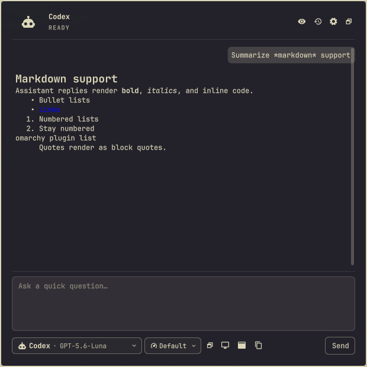
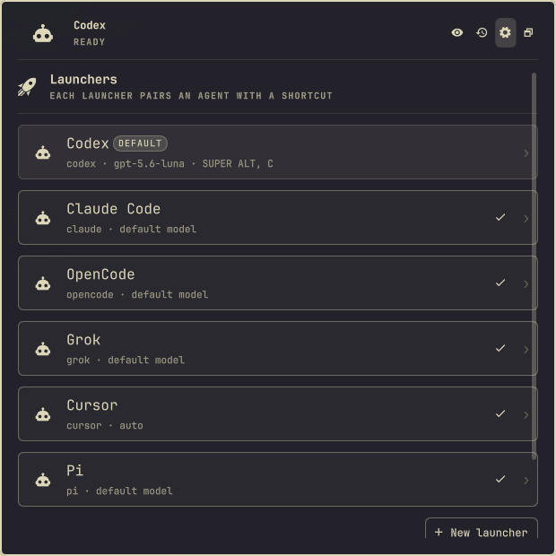

# Omarchy Quick Chat

Quick Chat is a third-party Omarchy shell plugin for fast Q&A through agent
CLIs already installed and authenticated on your machine. It opens as a
keyboard-first, centered 620×620 standard floating window. It remains a normal
desktop toplevel: other windows stay usable, Omarchy can tile or maximize it,
and Chat, History, and Settings share the current window geometry instead of
switching to a different shell surface.

| Chat | Launchers |
| --- | --- |
|  |  |

The built-in launchers are Codex, Claude Code, OpenCode, Grok, Cursor, and Pi.
Custom shell-free command launchers are also supported. Each launcher pairs an
agent and model with an optional summon shortcut, and one launcher is the
default summoned by the main shortcut and the menu entry.

## Install

```bash
omarchy plugin add https://github.com/goktugvatandas/omarchy-quick-chat.git --enable
```

Update or remove with the normal Omarchy plugin commands:

```bash
omarchy plugin update goktugvatandas.quick-chat
omarchy plugin remove goktugvatandas.quick-chat
```

Removal deletes the installed plugin; its runtime Hyprland shortcuts stop
working immediately and disappear on the next Hyprland reload. Your
configuration and history stay in `$XDG_CONFIG_HOME/omarchy/quick-chat` and
`$XDG_STATE_HOME/omarchy/quick-chat`; delete those directories to remove every
trace.

## Use

Fresh installs use `SUPER+ALT+C` to summon the default launcher. Schema-1
configurations migrate automatically and keep their existing global shortcut,
including the former `SUPER+ALT+SPACE` default. Each launcher can also have
its own Hyprland shortcut.

Settings opens on the launcher list. A row shows each launcher's agent, model,
and shortcut; the default launcher is marked and any row can be promoted with
one click. Opening a launcher edits the essentials — name, agent, model,
shortcut, default, and instructions — while icon, thinking effort, transport,
permission, workspace, retention, and custom-command fields stay in a
collapsed Advanced section. Window shortcuts and global history live in their
own collapsed sections under the list.

Enter sends;
`Ctrl+Enter` adds a line. `Escape` closes the deepest open picker or dialog,
returns a page to Chat, and only then hides the window; it does not cancel an
active turn. `Alt+Left` returns to Chat. `Tab` and `Shift+Tab` traverse every
interactive control, while arrows, `Home`, `End`, `Enter`, and `Space` operate
the picker and History cursors.

The configurable in-window defaults are:

| Action | Shortcut |
| --- | --- |
| Focus prompt | `Ctrl+L` |
| Agent and model | `Ctrl+K` |
| Thinking effort | `Ctrl+.` |
| History | `Ctrl+H` |
| Settings | `Ctrl+,` |
| Private mode | `Ctrl+Shift+P` |
| New chat | `Ctrl+N` |

Settings captures replacement shortcuts, reports duplicates and reserved keys,
and can reset the complete set to these defaults.

Use `Super+T` to move between floating and tiled layouts. Use Super+drag or a
header drag to move the floating window. The header maximize control and
`Super+Alt+F` both use Hyprland's standard maximize state and restore normally.
The plugin defines no local window alpha; inherited opacity, colors, font,
spacing, borders, and control states all follow the active Omarchy theme.

Quick Chat also adds a searchable **Quick Chat** action to the root Omarchy
menu. The entry is merged idempotently into the user menu extension without
replacing existing entries or comments, is sorted immediately after Apps, and
is hidden while the plugin is disabled. It remains a root item rather than
being nested inside the Apps submenu. Search aliases are `quick-chat`, `chat`,
and `ask`.

The window has no full-screen backdrop or click-blocking scrim. It requests
focus when summoned but does not hold focus, so it can stay visible while you
use another app.

The header switches profiles and toggles private mode. History keeps the 20
most recently updated conversations by default. Set any positive finite limit
or remove the configured count limit globally or per profile. The
512-conversation and 32 MiB history-file safety ceilings still apply. Clear
History removes Quick Chat's messages and session mappings, but does not
delete sessions owned by external CLIs. Quick Chat's own Pi session files
follow the retention limits documented below.

## CLI prerequisites

Install and authenticate any presets you intend to use through their native
tools:

- `codex`
- `claude`
- `opencode`
- `grok`
- `cursor-agent`
- `pi`

The plugin itself additionally needs `python3` ≥ 3.11 and `jq` on `PATH`
(the menu entry's `when` guard evaluates `~/.config/omarchy/shell.json` with
`jq`; without it the menu entry is silently hidden).

Cursor requires each working directory to be trusted once in its native CLI.
Quick Chat deliberately never passes `--trust`, `--force`, or `--yolo`; either
trust the profile directory interactively or configure a dedicated trusted
fixed directory. Pi requires at least one provider login before it can return a
model catalog: run `pi`, use `/login`, then refresh the Pi models in Quick Chat.

Quick Chat does not store API keys or provider credentials. A missing,
unauthenticated, unsupported, or degraded CLI is shown as an actionable inline
state. Unknown structured output degrades to plain text and disables resume,
native images, and relayed approvals while preserving read-only arguments.

## Launchers and safety

A launcher (stored as a profile in the configuration schema) selects the CLI
adapter, model, system instructions, working directory policy, allowed context
providers, permission policy, retention, private default, advanced arguments,
and shortcut. Fixed working directories must exist. Active-project launchers
resolve `/proc/<active-pid>/cwd` without a shell and fall back visibly to home
when unavailable.

The Model field discovers each harness's catalog through its native CLI and
opens it in Omarchy's searchable picker. Refresh reruns discovery; Custom model
ID keeps manual configuration available. Claude Code exposes its supported
`sonnet`, `opus`, and `haiku` aliases because its CLI has no catalog command.
Catalog calls use fixed argument arrays, bounded output, and short timeouts, and
their results are cached for the bridge lifetime.

The effort control sits immediately beside the agent/model control. It contains
only choices explicitly advertised for the active model or CLI. `Default`
means Quick Chat omits an effort override and lets the harness decide. If no
choice is advertised, the disabled control remains on `Default`; Quick Chat
does not guess. Changing to a model that does not support the saved choice
resets it safely and shows an inline explanation.

Native effort translation is deliberately adapter-specific:

- Codex uses `-c model_reasoning_effort="high"` before `exec`.
- Claude `--effort` receives the selected value.
- OpenCode `--variant` receives the selected value.
- Grok `--reasoning-effort` receives the selected value only when Grok
  advertises choices.
- Cursor `effort=` is merged into the selected model's final parameter block.
- Pi `--thinking` receives the selected value.

Cursor always runs with `--mode ask`; effort selection never weakens that
read-only Q&A mode.

Every built-in process adapter uses read-only or plan behavior. Quick Chat never
passes force, yolo, full-auto, dangerously-skip-permissions, or equivalent
flags. Custom command arguments are arrays; prompts and paths are never shell
interpolated. Custom commands are Q&A-only unless explicit read-only arguments
are configured.

Approvals offer only Approve once and Deny. If process mode cannot relay an
approval safely, Quick Chat denies it and offers to continue the native session
in a terminal.

Assistant replies keep Markdown headings, lists, emphasis, code, and normal
links. Quick Chat rewrites image syntax and raw HTML before QML renders the
reply, so provider text cannot load local or remote resources. Only `http`,
`https`, and `mailto` links can open externally.

Quick Chat caps each process or ACP line at 64 KiB, each response at 256 KiB,
and each run at 1,024 provider events. The process queue holds at most 64 lines.
Live and persisted conversations keep the newest 24 messages and at most 32 KiB
per persisted message. A history file above 32 MiB is quarantined instead of
loaded. Quick Chat also stops a Pi session at 4 MiB and retains at most 24 Pi
session files or 32 MiB total.

## Desktop context and privacy

Window, Screen, App, and Selected Text context is opt-in per message. Captures
are shown before sending. Window capture is the default visual choice;
full-screen capture always requires its own button. OCR is a separate explicit
action when the selected profile cannot receive images.

Runtime copies live under `$XDG_RUNTIME_DIR/omarchy-quick-chat`, use private
permissions, and are deleted after sending, cancellation, failure, removal, or
bridge shutdown. Private conversations write no Quick Chat messages,
attachments, or CLI session mappings.

Configuration is stored in
`$XDG_CONFIG_HOME/omarchy/quick-chat/config.json` and history in
`$XDG_STATE_HOME/omarchy/quick-chat/history.json`, with standard home-directory
fallbacks. Corrupt files are quarantined beside the original and defaults are
loaded with a visible recovery notice.

Configuration schema 2 adds the global `uiShortcuts` object and per-profile
`thinkingEffort` value. Loading schema 1 preserves profiles, model selection,
history/private/transport/custom-command settings, and existing summon keys,
then rewrites the validated configuration atomically when the config directory
is writable.

## Troubleshooting

Run the local non-graphical suite:

```bash
./test/all
```

The real-provider matrix is deliberately opt-in. It checks installation,
non-interactive authentication, live model discovery, production read-only
arguments, normalized output, and terminal completion for all six built-in
harnesses:

```bash
QUICK_CHAT_LIVE_HARNESSES=1 ./test/all
```

That command makes six real provider requests and may consume account quota.
It prints one credential-safe JSON result per harness and exits nonzero if any
harness is missing, unauthenticated, cannot discover a model, does not return
`QUICK_CHAT_OK`, writes inside the test working directory, or fails to emit a
normalized completion event.

Bridge diagnostics are emitted on stderr and never rendered as assistant text.
Inspect Omarchy shell logs and the quarantined path shown by a recovery notice.
Use Refresh probe after updating a CLI. Native login commands are only copied;
Quick Chat never logs in automatically.

Omarchy plugins execute unsandboxed inside the shell process. Review third-party
plugin source before enabling it. The bridge limits its own subprocesses and
files, but installing a plugin still grants code execution as your desktop user.

## Development

Runtime code uses Python's standard library, QML/Quickshell, and argument-array
subprocess execution. See [the bridge protocol](docs/bridge-protocol.md) and
[adapter authoring guide](docs/adapter-authoring.md).

The graphical acceptance test must only run in a disposable Omarchy guest:

```bash
QUICK_CHAT_DISPOSABLE=1 QUICK_CHAT_REPO="file://$PWD" \
  bash test/acceptance/quick-chat-test.sh
```
